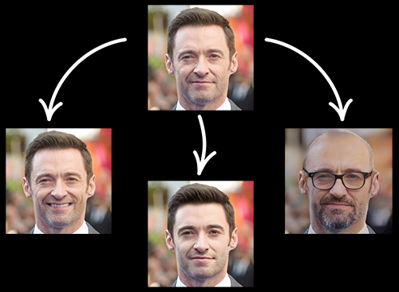

# FaceApp PHP API
 
Transform your face using Artificial Intelligence with PHP [FaceApp](http://faceapp.com) API <br>
FaceApp is an [Android](https://play.google.com/store/apps/details?id=io.faceapp) and [iOS](https://itunes.apple.com/app/id1180884341) application.<br>
This library is an unofficial wrapper to their AI system.<br>




## Requirements

* PHP >= 7.0
* cURL/PHP

## Basic usage

```php
<?php
require('FaceApp/faceapp.php');
try {
    $FaceApp = new FaceApp('test/image.jpg');

    $photoCode = $FaceApp->getPhotoCode();

    //to get all available filters use : $FaceApp->getFilters();

    $filter = 'old';

    $FaceApp->applyFilter($photoCode, $filter, false);

    if ($FaceApp->savePhoto('newImage.jpg')) {
        echo "Done!";
    }
} catch (Exception $e) {
    exit($e->getMessage());
}
```

## Methods

```php
$FaceApp = new FaceApp('PHOTO_PATH');
```

### getPhotoCode
Get the 'photo unique id' that has Been uploaded to faceapp servers
```php
$photoCode = $FaceApp->getPhotoCode();
```

### getFilters
Get all filters are available to apply the photo
```php
$photoCode = $FaceApp->getFilters(); //returns an array of filters

/*filters : 
	-no-filter
	-smile
	-smile_2
	-hot
	-old
	-young
	-hollywood
	-fun_glasses
	-hitman
	-mustache_free
	-pan
	-heisenberg
	-female
	-female_2
	-male
	-no-filter
	-impression
	-goatee
	-mustache
	-hipster
	-lion
	-bangs
	-glasses
	-wave
	-makeup
*/
```

### applyFilter
Get the code of photo has Been uploaded to faceapp servers
```php
$FaceApp->applyFilter(PHOTO_CODE , SELECTED_FILTER , CROP_FACE_OR_NOT);

//example :
//PHOTO_CODE(string) : $photoCode
//SELECTED_FILTER(string) : 'old'
//CROP_FACE_OR_NOT(bool) : true or false
```

### savePhoto
Save the final filtered photo
```php
$FaceApp->savePhoto('NEW_PHOTO_PATH.jpg');
```

### Proxy Mode
As you may know this service has some limits for requesting so I created a "Proxy Mode" for it<br>
Proxy servers has been added to faceapp.php line 44<br>
All of them works well but i dont guarantee them to work for a long time<br>
If you have any proxy server you can put it in the list<br>
And you can turn the proxy server on with this code<br>
```php
$FaceApp = new FaceApp('PHOTO_PATH', true );
```
Take a look at "ProxyMode.php"

## License

`Faceapp PHP API` is licensed under the MIT License - see the LICENSE file for details

## Description

Of course it is not a perfect and optimized project but u can develop it easily and improve it even better than me 😄❤

if there is any question or problem contact me in Telegram [@SubString](http://t.me/SubString) report it in issues.
Enjoy!

### -For my countrymen
<div dir="rtl" align="right">
سلام هموطن عزیز <br>
اصلی ترین دلیل و هدفی که از اوپن کردن این سورس داشتم، افزایش دانش عمومی بوده و هست<br>
و خوشحالم که میتونم با این کار به شما و دیگران کمک کنم،<br>
و چه خوب میشه یاد بگیریم به هم دیگه کمک کنیم<br>
و این فرهنگ (اوپن سورس بودن پروژه ها) رو توی کشور خودمون یعنی ایران جا بندازیم<br>
و در حد توانمون قانون کپی رایت و حقوق ناشر رو رعایت کنیم.<br>
 
</div>

<a href="http://FeeltheCode.com">FeeltheCode.com</a>
